# Docker-Intermediario
Atividade Prática 3º ano - Sistemas de Informação Checkpoint III

## Exercício 1.1


```bash
C:\Users\labsfiap>docker images
REPOSITORY   TAG       IMAGE ID   CREATED   SIZE

C:\Users\labsfiap>docker pull python:3.11-slim
3.11-slim: Pulling from library/python
19fb8589da02: Pull complete
e73850a50582: Pull complete
38513bd72563: Pull complete
a9ffe18d7fdb: Pull complete
Digest: sha256:b6000fc45f769f42c4c717dab2675bbb0ec6531c32a0483a2f78de0b7023e71b
Status: Downloaded newer image for python:3.11-slim
docker.io/library/python:3.11-slim

C:\Users\labsfiap>docker inspect python:3.11-slim
[
    {
        "Id": "sha256:b6000fc45f769f42c4c717dab2675bbb0ec6531c32a0483a2f78de0b7023e71b",
        "RepoTags": [
            "python:3.11-slim"
        ],
        "RepoDigests": [
            "python@sha256:b6000fc45f769f42c4c717dab2675bbb0ec6531c32a0483a2f78de0b7023e71b"
        ],
        "Parent": "",
        "Comment": "buildkit.dockerfile.v0",
        "Created": "2025-10-09T21:44:07Z",
        "DockerVersion": "",
        "Author": "",
        "Config": {
            "Hostname": "",
            "Domainname": "",
            "User": "",
            "AttachStdin": false,
            "AttachStdout": false,
            "AttachStderr": false,
            "Tty": false,
            "OpenStdin": false,
            "StdinOnce": false,
            "Env": [
                "PATH=/usr/local/bin:/usr/local/sbin:/usr/local/bin:/usr/sbin:/usr/bin:/sbin:/bin",
                "LANG=C.UTF-8",
                "GPG_KEY=A035C8C19219BA821ECEA86B64E628F8D684696D",
                "PYTHON_VERSION=3.11.14",
                "PYTHON_SHA256=8d3ed8ec5c88c1c95f5e558612a725450d2452813ddad5e58fdb1a53b1209b78"
            ],
            "Cmd": [
                "python3"
            ],
            "Image": "",
            "Volumes": null,
            "WorkingDir": "",
            "Entrypoint": null,
            "OnBuild": null,
            "Labels": null
        },
        "Architecture": "amd64",
        "Os": "linux",
        "Size": 45446475,
        "GraphDriver": {
            "Data": null,
            "Name": "overlayfs"
        },
        "RootFS": {
            "Type": "layers",
            "Layers": [
                "sha256:d7c97cb6f1fe7cae982649e9f55efe201212e8acaa64bd668c083b204e4efd4c",
                "sha256:15eb6aec49b38357916ea069cb57c890841f4e40588c54ebba117f6314911d37",
                "sha256:9ba402f61141e835fb247b8592f61ea2a885de652bbb368fe9cea93cbc8c324a",
                "sha256:235e8192987624c55713750efe67254a8dbfe540c7a59c1d33353f928e42d80d"
            ]
        },
        "Metadata": {
            "LastTagTime": "2025-10-21T22:22:23.855401324Z"
        },
        "Descriptor": {
            "mediaType": "application/vnd.oci.image.index.v1+json",
            "digest": "sha256:b6000fc45f769f42c4c717dab2675bbb0ec6531c32a0483a2f78de0b7023e71b",
            "size": 10373
        }
    }
]

C:\Users\labsfiap>docker history python:3.11-slim
IMAGE          CREATED       CREATED BY                                      SIZE      COMMENT
b6000fc45f76   12 days ago   CMD ["python3"]                                 0B        buildkit.dockerfile.v0
<missing>      12 days ago   RUN /bin/sh -c set -eux;  for src in idle3 p…   16.4kB    buildkit.dockerfile.v0
<missing>      12 days ago   RUN /bin/sh -c set -eux;   savedAptMark="$(a…   48.4MB    buildkit.dockerfile.v0
<missing>      12 days ago   ENV PYTHON_SHA256=8d3ed8ec5c88c1c95f5e558612…   0B        buildkit.dockerfile.v0
<missing>      12 days ago   ENV PYTHON_VERSION=3.11.14                      0B        buildkit.dockerfile.v0
<missing>      12 days ago   ENV GPG_KEY=A035C8C19219BA821ECEA86B64E628F8…   0B        buildkit.dockerfile.v0
<missing>      12 days ago   RUN /bin/sh -c set -eux;  apt-get update;  a…   4.94MB    buildkit.dockerfile.v0
<missing>      12 days ago   ENV LANG=C.UTF-8                                0B        buildkit.dockerfile.v0
<missing>      12 days ago   ENV PATH=/usr/local/bin:/usr/local/sbin:/usr…   0B        buildkit.dockerfile.v0
<missing>      12 days ago   # debian.sh --arch 'amd64' out/ 'trixie' '@1…   87.4MB    debuerreotype 0.16
```
## Exercício 1.2


```bash
C:\Users\labsfiap>docker pull node:18-alpine
18-alpine: Pulling from library/node
dd71dde834b5: Pull complete
25ff2da83641: Pull complete
1e5a4c89cee5: Pull complete
f18232174bc9: Pull complete
Digest: sha256:8d6421d663b4c28fd3ebc498332f249011d118945588d0a35cb9bc4b8ca09d9e
Status: Downloaded newer image for node:18-alpine
docker.io/library/node:18-alpine

C:\Users\labsfiap>docker pull node:20-alpine
20-alpine: Pulling from library/node
da04d522c98f: Pull complete
2d35ebdb57d9: Pull complete
60e45a9660cf: Pull complete
e74e4ed823e9: Pull complete
Digest: sha256:b2f9cb7d40318fb5e530527f657af5e765271867a25f317b974ed4b3069da7d8
Status: Downloaded newer image for node:20-alpine
docker.io/library/node:20-alpine

C:\Users\labsfiap>docker images | findstr node
node         20-alpine   b2f9cb7d4031   5 days ago     191MB
node         18-alpine   8d6421d663b4   6 months ago   181MB

C:\Users\labsfiap>docker tag node:20-alpine meu-node:latest

C:\Users\labsfiap>docker image prune
WARNING! This will remove all dangling images.
Are you sure you want to continue? [y/N] y
Total reclaimed space: 0B
```
## Exercício 1.3

&nbsp;
[analise-imagens](./analise-imagens.txt)

## Exercício 2.1


## Exercício 2.2
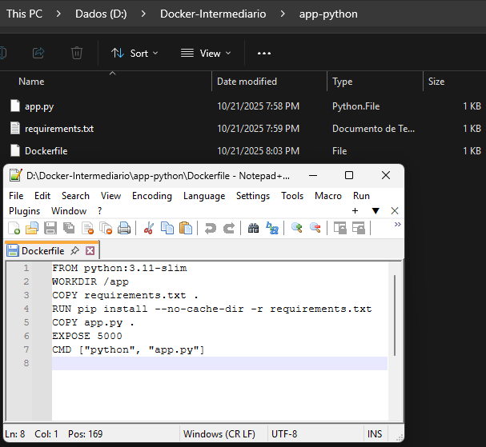

## Exercício 2.3
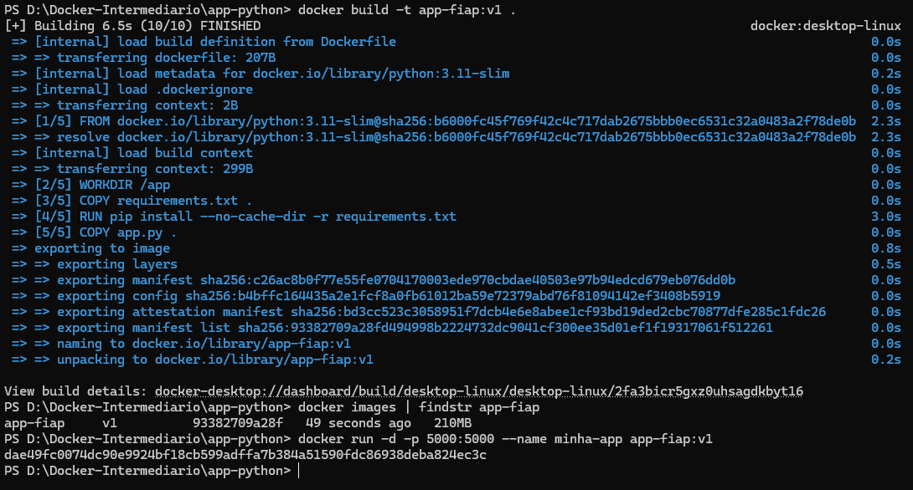
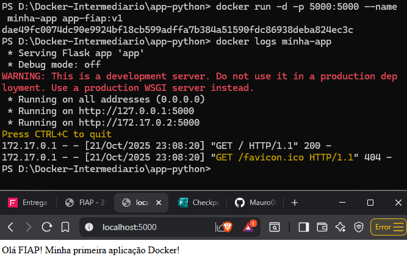

```bash
PS D:\Docker-Intermediario\app-python> docker build -t app-fiap:v1 .
[+] Building 6.5s (10/10) FINISHED                                                                 docker:desktop-linux
 => [internal] load build definition from Dockerfile                                                               0.0s
 => => transferring dockerfile: 207B                                                                               0.0s
 => [internal] load metadata for docker.io/library/python:3.11-slim                                                0.2s
 => [internal] load .dockerignore                                                                                  0.0s
 => => transferring context: 2B                                                                                    0.0s
 => [1/5] FROM docker.io/library/python:3.11-slim@sha256:b6000fc45f769f42c4c717dab2675bbb0ec6531c32a0483a2f78de0b  2.3s
 => => resolve docker.io/library/python:3.11-slim@sha256:b6000fc45f769f42c4c717dab2675bbb0ec6531c32a0483a2f78de0b  2.3s
 => [internal] load build context                                                                                  0.0s
 => => transferring context: 299B                                                                                  0.0s
 => [2/5] WORKDIR /app                                                                                             0.0s
 => [3/5] COPY requirements.txt .                                                                                  0.0s
 => [4/5] RUN pip install --no-cache-dir -r requirements.txt                                                       3.0s
 => [5/5] COPY app.py .                                                                                            0.0s
 => exporting to image                                                                                             0.8s
 => => exporting layers                                                                                            0.5s
 => => exporting manifest sha256:c26ac8b0f77e55fe0704170003ede970cbdae40503e97b94edcd679eb076dd0b                  0.0s
 => => exporting config sha256:b4bffc164435a2e1fcf8a0fb61012ba59e72379abd76f81094142ef3408b5919                    0.0s
 => => exporting attestation manifest sha256:bd3cc523c3058951f7dcb4e6e8abee1cf93bd19ded2cbc70877dfe285c1fdc26      0.0s
 => => exporting manifest list sha256:93382709a28fd494998b2224732dc9041cf300ee35d01ef1f19317061f512261             0.0s
 => => naming to docker.io/library/app-fiap:v1                                                                     0.0s
 => => unpacking to docker.io/library/app-fiap:v1                                                                  0.2s

View build details: docker-desktop://dashboard/build/desktop-linux/desktop-linux/2fa3bicr5gxz0uhsagdkbyt16
PS D:\Docker-Intermediario\app-python> docker images | findstr app-fiap
app-fiap     v1          93382709a28f   49 seconds ago   210MB
PS D:\Docker-Intermediario\app-python> docker run -d -p 5000:5000 --name minha-app app-fiap:v1
dae49fc0074dc90e9924bf18cb599adffa7b384a51590fdc86938deba824ec3c
```

## Exercício 2.4
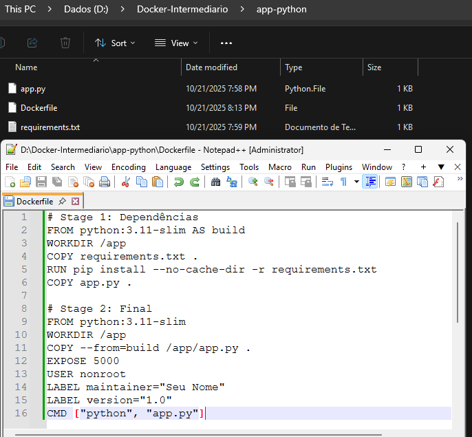

```bash
PS D:\Docker-Intermediario\app-python> docker logs minha-app
 * Serving Flask app 'app'
 * Debug mode: off
WARNING: This is a development server. Do not use it in a production deployment. Use a production WSGI server instead.
 * Running on all addresses (0.0.0.0)
 * Running on http://127.0.0.1:5000
 * Running on http://172.17.0.2:5000
```

## Exercício 3.1
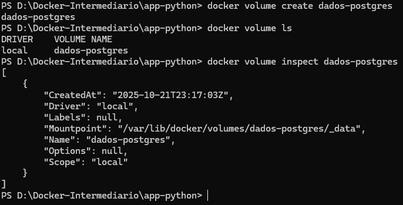
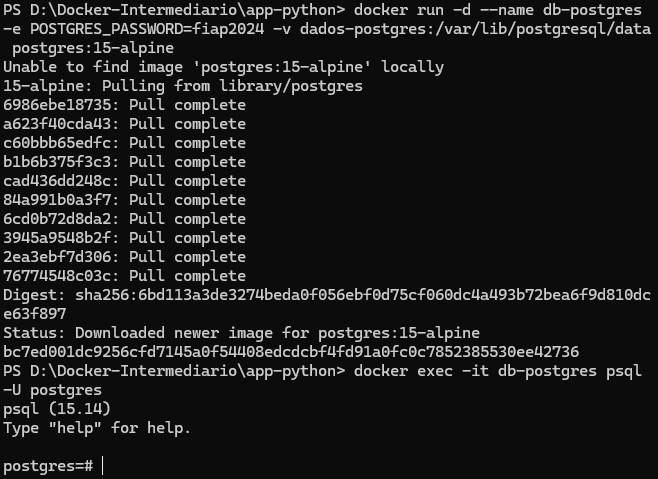

```bash
PS D:\Docker-Intermediario\app-python> docker volume create dados-postgres
dados-postgres
PS D:\Docker-Intermediario\app-python> docker volume ls
DRIVER    VOLUME NAME
local     dados-postgres
PS D:\Docker-Intermediario\app-python> docker volume inspect dados-postgres
[
    {
        "CreatedAt": "2025-10-21T23:17:03Z",
        "Driver": "local",
        "Labels": null,
        "Mountpoint": "/var/lib/docker/volumes/dados-postgres/_data",
        "Name": "dados-postgres",
        "Options": null,
        "Scope": "local"
    }
]

PS D:\Docker-Intermediario\app-python> docker run -d --name db-postgres -e POSTGRES_PASSWORD=fiap2024 -v dados-postgres:/var/lib/postgresql/data postgres:15-alpine
Unable to find image 'postgres:15-alpine' locally
15-alpine: Pulling from library/postgres
6986ebe18735: Pull complete
a623f40cda43: Pull complete
c60bbb65edfc: Pull complete
b1b6b375f3c3: Pull complete
cad436dd248c: Pull complete
84a991b0a3f7: Pull complete
6cd0b72d8da2: Pull complete
3945a9548b2f: Pull complete
2ea3ebf7d306: Pull complete
76774548c03c: Pull complete
Digest: sha256:6bd113a3de3274beda0f056ebf0d75cf060dc4a493b72bea6f9d810dce63f897
Status: Downloaded newer image for postgres:15-alpine
bc7ed001dc9256cfd7145a0f54408edcdcbf4fd91a0fc0c7852385530ee42736
PS D:\Docker-Intermediario\app-python> docker exec -it db-postgres psql -U postgres
psql (15.14)
Type "help" for help.

postgres=#
```

## Exercício 3.2
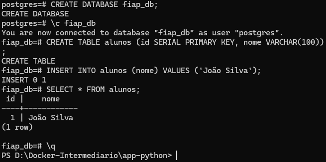
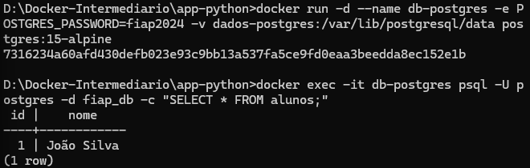

```bash
D:\Docker-Intermediario\app-python>docker run -d --name db-postgres -e POSTGRES_PASSWORD=fiap2024 -v dados-postgres:/var/lib/postgresql/data postgres:15-alpine
7316234a60afd430defb023e93c9bb13a537fa5ce9fd0eaa3beedda8ec152e1b

D:\Docker-Intermediario\app-python>docker exec -it db-postgres psql -U postgres -d fiap_db -c "SELECT * FROM alunos;"
 id |    nome
----+------------
  1 | João Silva
(1 row)
```

## Exercício 3.3
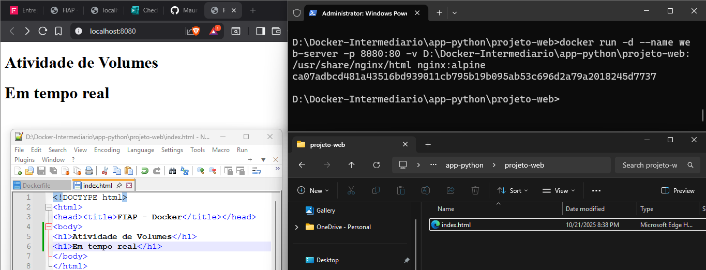

```bash
D:\Docker-Intermediario\app-python\projeto-web>docker run -d --name web-server -p 8080:80 -v D:\Docker-Intermediario\app-python\projeto-web:/usr/share/nginx/html nginx:alpine
ca07adbcd481a43516bd939011cb795b19b095ab53c696d2a79a2018245d7737
```

## Exercício 4.1
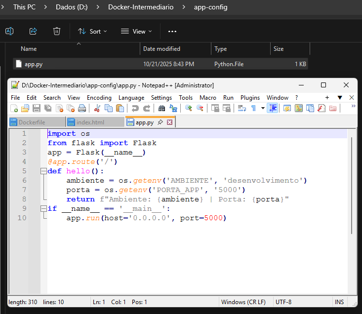
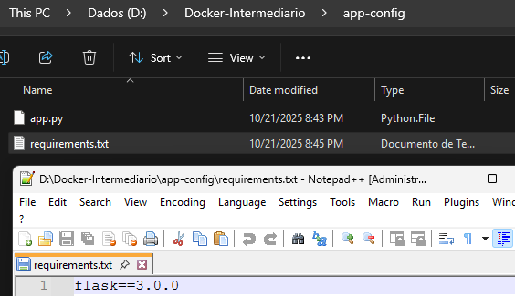

## Exercício 4.2
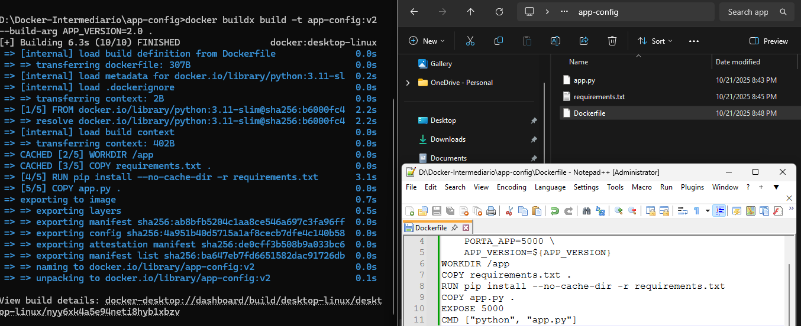

## Exercício 4.3
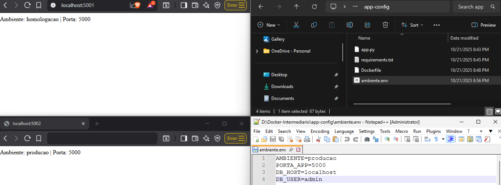

```bash
D:\Docker-Intermediario\app-config>docker inspect -f '{{.Config.Env}}' app-prod
'[AMBIENTE=producao PORTA_APP=5000 DB_HOST=localhost DB_USER=admin PATH=/usr/local/bin:/usr/local/sbin:/usr/local/bin:/usr/sbin:/usr/bin:/sbin:/bin LANG=C.UTF-8 GPG_KEY=A035C8C19219BA821ECEA86B64E628F8D684696D PYTHON_VERSION=3.11.14 PYTHON_SHA256=8d3ed8ec5c88c1c95f5e558612a725450d2452813ddad5e58fdb1a53b1209b78 APP_VERSION=2.0]'
```
