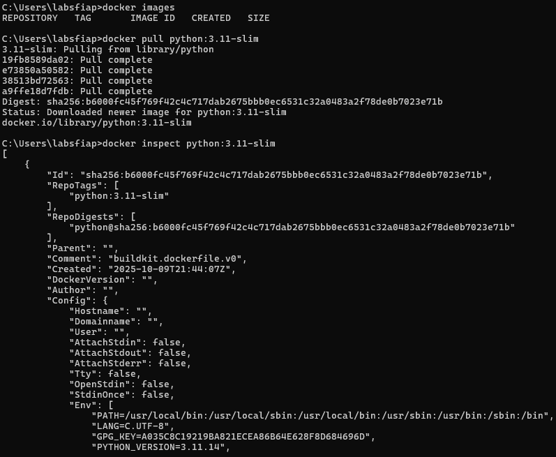
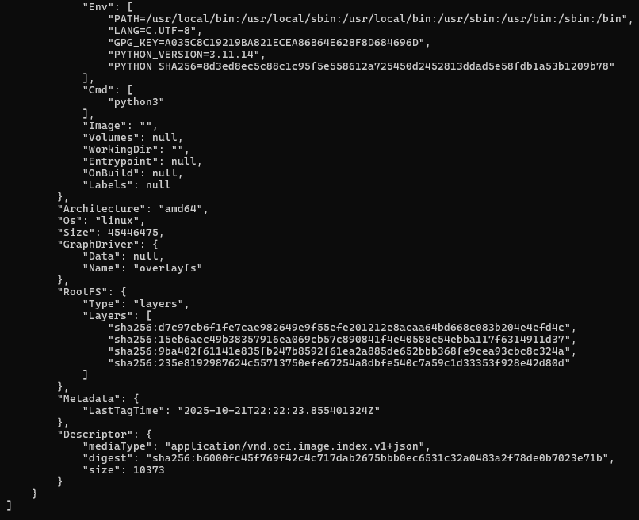
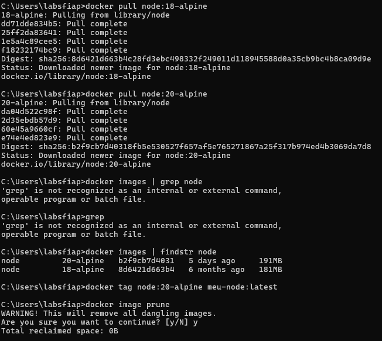
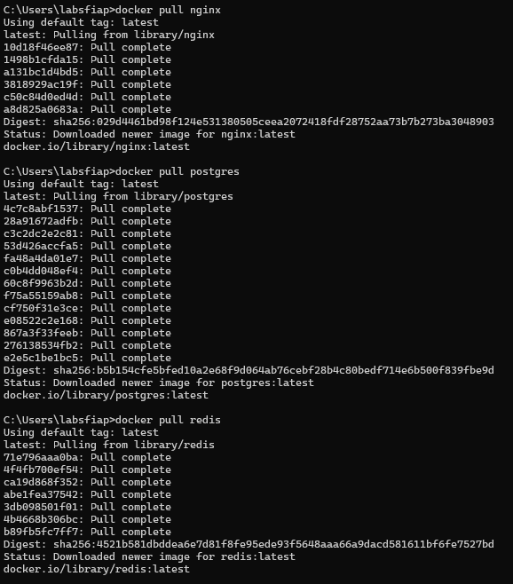
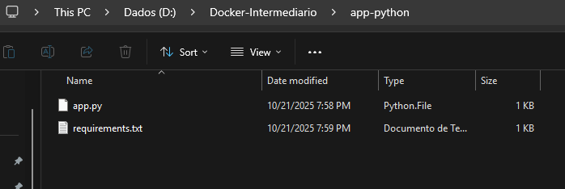

# Docker-Intermediario
Atividade Prática 3º ano - Sistemas de Informação Checkpoint III

## Exercício 1.1



```bash
C:\Users\labsfiap>docker images
REPOSITORY   TAG       IMAGE ID   CREATED   SIZE

C:\Users\labsfiap>docker pull python:3.11-slim
3.11-slim: Pulling from library/python
19fb8589da02: Pull complete
e73850a50582: Pull complete
38513bd72563: Pull complete
a9ffe18d7fdb: Pull complete
Digest: sha256:b6000fc45f769f42c4c717dab2675bbb0ec6531c32a0483a2f78de0b7023e71b
Status: Downloaded newer image for python:3.11-slim
docker.io/library/python:3.11-slim

C:\Users\labsfiap>docker inspect python:3.11-slim
[
    {
        "Id": "sha256:b6000fc45f769f42c4c717dab2675bbb0ec6531c32a0483a2f78de0b7023e71b",
        "RepoTags": [
            "python:3.11-slim"
        ],
        "RepoDigests": [
            "python@sha256:b6000fc45f769f42c4c717dab2675bbb0ec6531c32a0483a2f78de0b7023e71b"
        ],
        "Parent": "",
        "Comment": "buildkit.dockerfile.v0",
        "Created": "2025-10-09T21:44:07Z",
        "DockerVersion": "",
        "Author": "",
        "Config": {
            "Hostname": "",
            "Domainname": "",
            "User": "",
            "AttachStdin": false,
            "AttachStdout": false,
            "AttachStderr": false,
            "Tty": false,
            "OpenStdin": false,
            "StdinOnce": false,
            "Env": [
                "PATH=/usr/local/bin:/usr/local/sbin:/usr/local/bin:/usr/sbin:/usr/bin:/sbin:/bin",
                "LANG=C.UTF-8",
                "GPG_KEY=A035C8C19219BA821ECEA86B64E628F8D684696D",
                "PYTHON_VERSION=3.11.14",
                "PYTHON_SHA256=8d3ed8ec5c88c1c95f5e558612a725450d2452813ddad5e58fdb1a53b1209b78"
            ],
            "Cmd": [
                "python3"
            ],
            "Image": "",
            "Volumes": null,
            "WorkingDir": "",
            "Entrypoint": null,
            "OnBuild": null,
            "Labels": null
        },
        "Architecture": "amd64",
        "Os": "linux",
        "Size": 45446475,
        "GraphDriver": {
            "Data": null,
            "Name": "overlayfs"
        },
        "RootFS": {
            "Type": "layers",
            "Layers": [
                "sha256:d7c97cb6f1fe7cae982649e9f55efe201212e8acaa64bd668c083b204e4efd4c",
                "sha256:15eb6aec49b38357916ea069cb57c890841f4e40588c54ebba117f6314911d37",
                "sha256:9ba402f61141e835fb247b8592f61ea2a885de652bbb368fe9cea93cbc8c324a",
                "sha256:235e8192987624c55713750efe67254a8dbfe540c7a59c1d33353f928e42d80d"
            ]
        },
        "Metadata": {
            "LastTagTime": "2025-10-21T22:22:23.855401324Z"
        },
        "Descriptor": {
            "mediaType": "application/vnd.oci.image.index.v1+json",
            "digest": "sha256:b6000fc45f769f42c4c717dab2675bbb0ec6531c32a0483a2f78de0b7023e71b",
            "size": 10373
        }
    }
]

C:\Users\labsfiap>docker history python:3.11-slim
IMAGE          CREATED       CREATED BY                                      SIZE      COMMENT
b6000fc45f76   12 days ago   CMD ["python3"]                                 0B        buildkit.dockerfile.v0
<missing>      12 days ago   RUN /bin/sh -c set -eux;  for src in idle3 p…   16.4kB    buildkit.dockerfile.v0
<missing>      12 days ago   RUN /bin/sh -c set -eux;   savedAptMark="$(a…   48.4MB    buildkit.dockerfile.v0
<missing>      12 days ago   ENV PYTHON_SHA256=8d3ed8ec5c88c1c95f5e558612…   0B        buildkit.dockerfile.v0
<missing>      12 days ago   ENV PYTHON_VERSION=3.11.14                      0B        buildkit.dockerfile.v0
<missing>      12 days ago   ENV GPG_KEY=A035C8C19219BA821ECEA86B64E628F8…   0B        buildkit.dockerfile.v0
<missing>      12 days ago   RUN /bin/sh -c set -eux;  apt-get update;  a…   4.94MB    buildkit.dockerfile.v0
<missing>      12 days ago   ENV LANG=C.UTF-8                                0B        buildkit.dockerfile.v0
<missing>      12 days ago   ENV PATH=/usr/local/bin:/usr/local/sbin:/usr…   0B        buildkit.dockerfile.v0
<missing>      12 days ago   # debian.sh --arch 'amd64' out/ 'trixie' '@1…   87.4MB    debuerreotype 0.16
```
## Exercício 1.2


```bash
C:\Users\labsfiap>docker pull node:18-alpine
18-alpine: Pulling from library/node
dd71dde834b5: Pull complete
25ff2da83641: Pull complete
1e5a4c89cee5: Pull complete
f18232174bc9: Pull complete
Digest: sha256:8d6421d663b4c28fd3ebc498332f249011d118945588d0a35cb9bc4b8ca09d9e
Status: Downloaded newer image for node:18-alpine
docker.io/library/node:18-alpine

C:\Users\labsfiap>docker pull node:20-alpine
20-alpine: Pulling from library/node
da04d522c98f: Pull complete
2d35ebdb57d9: Pull complete
60e45a9660cf: Pull complete
e74e4ed823e9: Pull complete
Digest: sha256:b2f9cb7d40318fb5e530527f657af5e765271867a25f317b974ed4b3069da7d8
Status: Downloaded newer image for node:20-alpine
docker.io/library/node:20-alpine

C:\Users\labsfiap>docker images | findstr node
node         20-alpine   b2f9cb7d4031   5 days ago     191MB
node         18-alpine   8d6421d663b4   6 months ago   181MB

C:\Users\labsfiap>docker tag node:20-alpine meu-node:latest

C:\Users\labsfiap>docker image prune
WARNING! This will remove all dangling images.
Are you sure you want to continue? [y/N] y
Total reclaimed space: 0B
```
## Exercício 1.3

[analise-imagens](./analise-imagens.txt)

## Exercício 2.1
